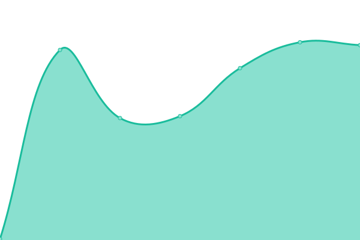

# [📈 Live Status](https://greend139.github.io/Uptime-checks): <!--live status--> **🟩 All systems operational**

This repository contains the open-source uptime monitor and status page for [Michael Daley](https://greend139.github.io/Uptime-checks), powered by [Upptime](https://github.com/upptime/upptime).

With [Upptime](https://upptime.js.org), you can get your own unlimited and free uptime monitor and status page, powered entirely by a GitHub repository. We use [Issues](https://github.com/greend139/Uptime-checks/issues) as incident reports, [Actions](https://github.com/greend139/Uptime-checks/actions) as uptime monitors, and [Pages](https://greend139.github.io/Uptime-checks) for the status page.

<!--start: status pages-->
<!-- This summary is generated by Upptime (https://github.com/upptime/upptime) -->
<!-- Do not edit this manually, your changes will be overwritten -->
<!-- prettier-ignore -->
| URL | Status | History | Response Time | Uptime |
| --- | ------ | ------- | ------------- | ------ |
|  [CCRI](https://www.ccri.edu) | 🟩 Up | [ccri.yml](https://github.com/greend139/Uptime-checks/commits/HEAD/history/ccri.yml) | 

 175ms
     
 | 

<a href="https://greend139.github.io/Uptime-checks/history/ccri">100.00%</a>
    

|  [SSO](https://sts.ccri.edu/cas/login) | 🟩 Up | [sso.yml](https://github.com/greend139/Uptime-checks/commits/HEAD/history/sso.yml) | 

 192ms
     
 | 

<a href="https://greend139.github.io/Uptime-checks/history/sso">100.00%</a>
    

|  [Connect2](https://connect2.ccri.edu:10443) | 🟩 Up | [connect2.yml](https://github.com/greend139/Uptime-checks/commits/HEAD/history/connect2.yml) | 

 167ms
     
 | 

<a href="https://greend139.github.io/Uptime-checks/history/connect2">100.00%</a>
    

<!--end: status pages-->

[**Visit our status website →**](https://greend139.github.io/Uptime-checks)

## 📄 License

- Powered by: [Upptime](https://github.com/upptime/upptime)
- Code: [MIT](./LICENSE) © [Anand Chowdhary](https://anandchowdhary.com), supported by [Pabio](https://pabio.com)
- Data in the `./history` directory: [Open Database License](https://opendatacommons.org/licenses/odbl/1-0/)
